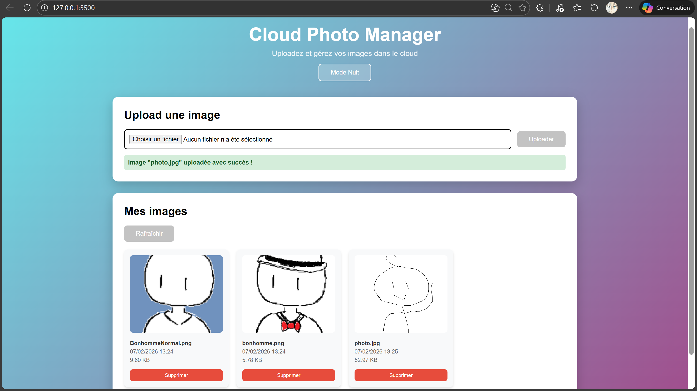
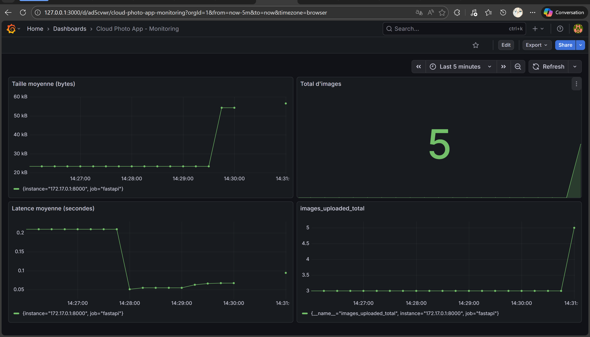

# S3tna - Cloud Photo Manager

Application web de gestion d'images avec architecture cloud simulée localement via LocalStack.



## Description
Ce projet simule une architecture cloud moderne pour stocker et gérer des images avec traitement automatique et monitoring en temps réel.

## Architecture

Voir le [schéma d'architecture détaillé](ARCHITECTURE.md)

### Flux de traitement
```
Upload → API → S3 (original) → BDD (métadonnées) 
                ↓
            Lambda (resize)
                ↓
            S3 (miniature 300x300)
                ↓
            BDD (update thumbnail_url)

### Composants

- **Frontend** : Interface web responsive (HTML/CSS/JS)
- **Backend API** : FastAPI (Python)
- **Stockage** : S3 simulé via LocalStack
- **Base de données** : SQLite pour les métadonnées
- **Lambda** : Fonction de redimensionnement d'images
- **Monitoring** : Prometheus + Grafana

## Fonctionnalités

### Core Features
- Upload d'images via interface web
- Stockage dans S3 (LocalStack)
- Création automatique de miniatures (300x300px)
- Galerie d'images responsive
- Suppression d'images
- Métadonnées en base SQLite

### UI/UX
- Mode sombre/clair avec sauvegarde de préférence
- Design moderne avec dégradés
- Affichage des métadonnées (date, taille)
- Clic sur miniature pour voir l'originale

### Monitoring
- Prometheus : Collecte de métriques
- Grafana : Dashboards temps réel
- Métriques suivies :
  - Nombre d'images uploadées
  - Latence de l'API
  - Taille des images
  - Total d'images stockées

## Technologies utilisées

### Backend
- **FastAPI** : Framework API REST
- **Boto3** : Client AWS/S3
- **Pillow** : Traitement d'images
- **SQLite** : Base de données
- **Prometheus Client** : Métriques

### Frontend
- **HTML5/CSS3/JavaScript** : Interface utilisateur
- **Fetch API** : Communication API

### Infrastructure
- **Docker Compose** : Orchestration de containers
- **LocalStack** : Simulation AWS
- **Prometheus** : Collecte de métriques
- **Grafana** : Visualisation
## Installation

### Prérequis
- Docker & Docker Compose
- Python 3.x
- AWS CLI

1. **Cloner le projet**
```bash
git clone git@rendu-git.etna-alternance.net:module-10141/activity-54892/group-1070826.git
cd group-1070826
```
2. Configurer les variables d'environnement
```bash
cp .env.example .env
```

3. Lancer LocalStack
```bash
docker compose up -d
```

Containers lancés :
- LocalStack (port 4566)
- Prometheus (port 9090)
- Grafana (port 3000)

4. Créer le bucket S3
```bash
aws --endpoint-url=http://localhost:4566 s3 mb s3://cloud-photo-bucket
```

5. Configurer le firewall
```bash
sudo ufw allow 8000/tcp
```

6. Installer les dépendances Python
```bash
python3 -m venv venv
source venv/bin/activate
pip install -r requirements.txt
```

7. Lancer l'API Backend
```bash
python -m uvicorn backend.main:app --reload --host 0.0.0.0 --port 8000
```

8. Lancer le serveur Frontend
```bash
cd frontend
python3 -m http.server 5500
```

## Accès aux interfaces

| Service | URL |
|---------|-----|
| **Frontend** | http://127.0.0.1:5500 |
| **API** | http://127.0.0.1:8000 |
| **API Docs** | http://127.0.0.1:8000/docs |
| **Prometheus** | http://127.0.0.1:9090 |
| **Grafana** | http://127.0.0.1:3000 |

## Endpoints
Upload une image et crée automatiquement une miniature.

**Exemple** :
```bash
curl -X POST "http://127.0.0.1:8000/upload" \
  -F "file=@photo.jpg"
```

**Réponse** :
```json
{
  "message": "uploaded",
  "filename": "photo.jpg",
  "thumbnail_url": "http://localhost:4566/cloud-photo-bucket/photo_thumb.jpg"
}
```

### GET /images
Liste toutes les images avec leurs métadonnées.

**Exemple** :
```bash
curl http://127.0.0.1:8000/images
```

### DELETE /images/{filename}
Supprime une image et sa miniature.

**Exemple** :
```bash
curl -X DELETE "http://127.0.0.1:8000/images/photo.jpg"
```

### Dashboard Grafana



**Connexion** : admin / admin (changez le mot de passe dans `.env`)

Le dashboard "Cloud Photo App - Monitoring" affiche :
1. **Images uploadées** : Évolution du nombre d'uploads
2. **Latence moyenne** : Performance de l'API
3. **Total d'images** : État du stock
4. **Taille moyenne** : Distribution des tailles de fichiers


## Auteur

Projet réalisé dans le cadre de la formation ETNA.